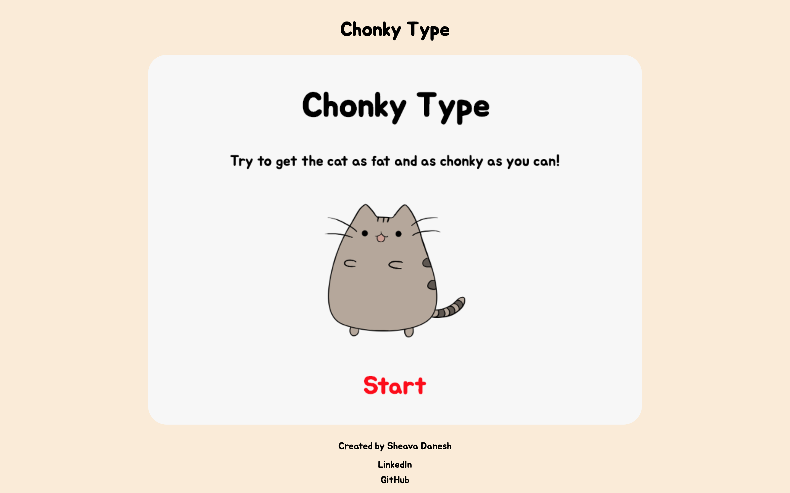
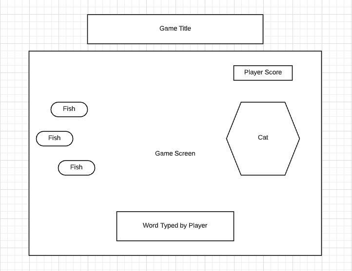
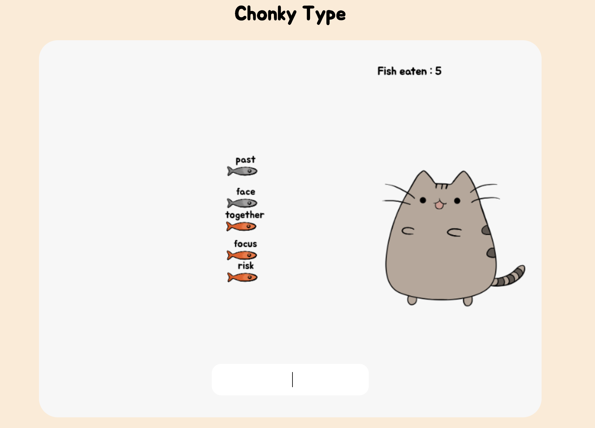
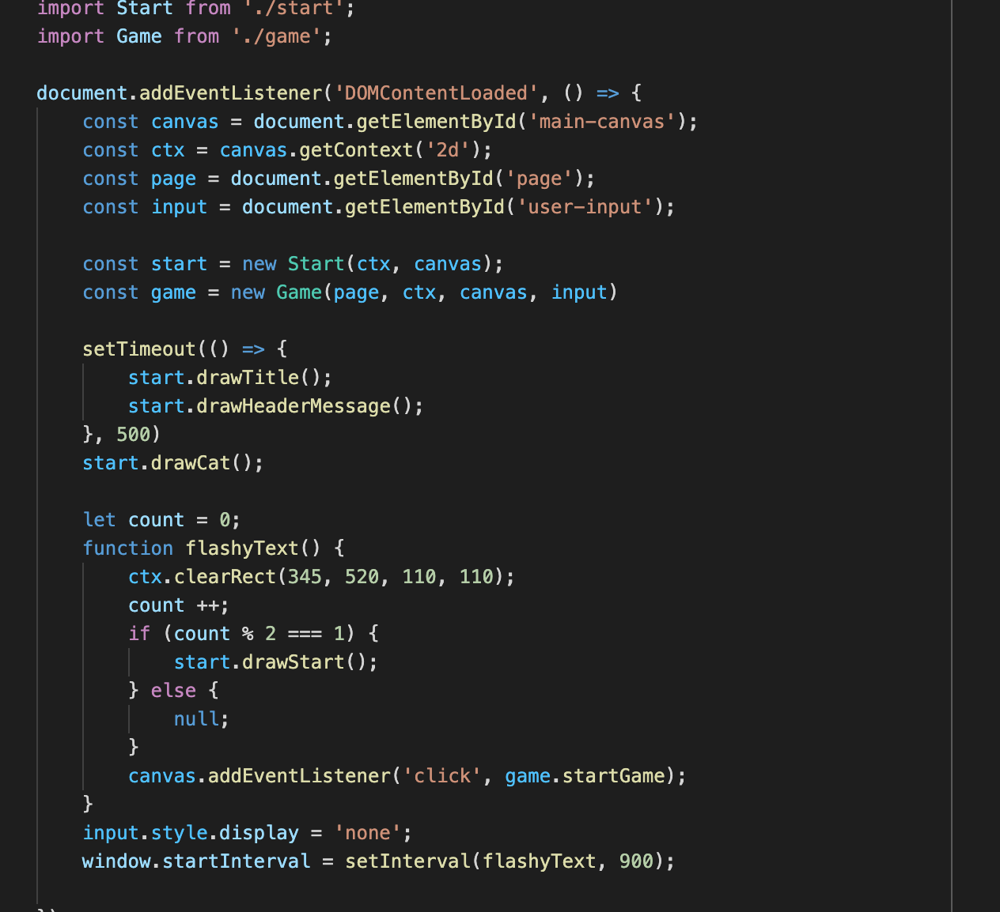
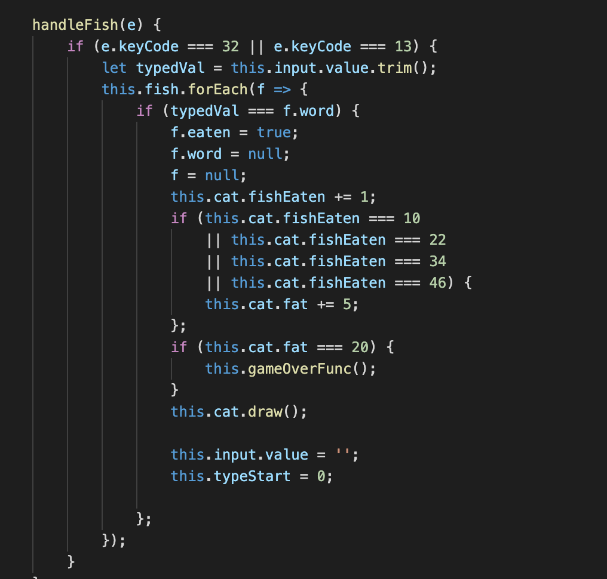
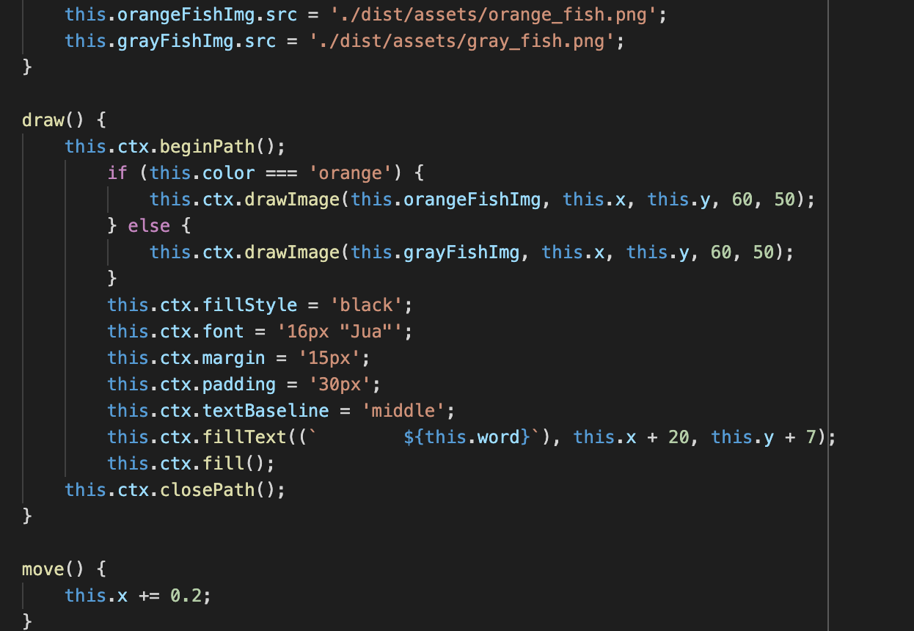
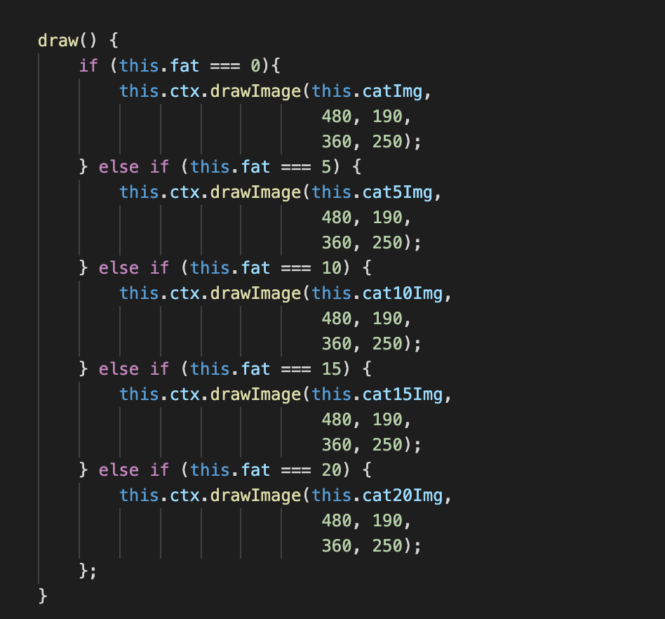
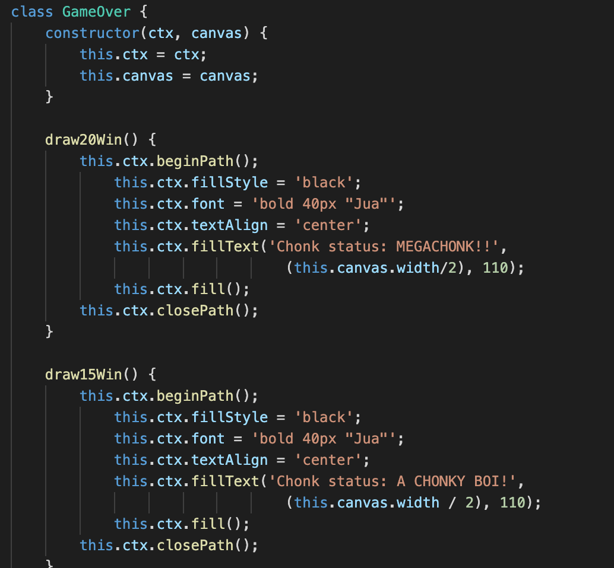

# Chonky Type

View <a href='https://sheavadanesh.github.io/chonky-type/'>Chonky Type</a>

# About Chonky Type

Chonky Type is a typing game made with pure Vanilla JavaScript. The objective of the game is to type out words correctly, which allows the cat on screen to eat fish for every word typed. Players eventually win the game when the cat reaches a certain fatness level from eating fish!

# Technologies

* ES6 JavaScript
* HTML5/Canvas
* CSS
* Webpack
* GitHub Pages

# Wireframe

# Features

## Gameplay

Upon hitting the start button on the homepage, the start screen renders a clear canvas upon which the player waits for a fish to appear from the far left side of the canvas. Each fish that appears on the screen is associated with a word that the player will need to type out on the input box on the bottom of the canvas. 

The location of the fish on the canvas is randomly generated. Upon creation, each fish is assigned an "eaten" boolean property which is by default set to "false". When the player types out the word correctly, the "eaten" property of that fish becomes "true" and disappears from the screen. This triggers a count that will show on the top right corner of the canvas, which shows how many words have been typed correctly. 

### Code Snippets

Javascript code snippet from the Start class:

Javascript code snippet for handling user input and the cat eating fish:

Javascript code snippet from the Fish class:

## Levels

Each level of the game is determined by a specific number of words that are typed. Upon reaching the threshold number of words typed, a new image of the cat will appear on the right hand side of the screen, albeit slightly fatter and signaling progression onto the next level.

### Code Snippets

Javascript code snippet from the Cat class where each value of "fatness" represents a new level:

## Game Over

The player wins the game when the cat achieves its final level of "fatness". Upon reaching the final level, the canvas is cleared and the game-over screen is rendered, showing a congratulatory message. However, the player loses the game if the player fails to type out a total of five words, which are counted in addition to words typed. This will render a game-over screen that displays a message relative to the level the player was last on.

### Code Snippets

Javascript code snippet from the GameOver class:

